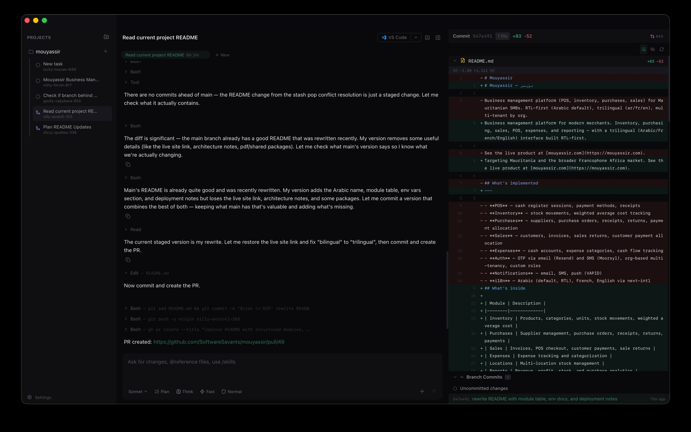

# Verun

Run multiple Claude Code sessions in parallel, each in its own isolated git worktree. Native macOS app.



## Features

- **Parallel sessions** — run as many Claude Code agents as you want, simultaneously
- **Isolated worktrees** — each task gets its own git worktree and branch, no conflicts
- **Inline diffs** — see exactly what Claude changed with syntax-highlighted diffs
- **Git actions** — commit, push, create PR, merge — all without leaving the app
- **Plan mode** — review implementation plans before Claude starts coding
- **Tool approval** — configurable trust levels (Normal, Supervised, Full Auto)
- **Resumable** — sessions survive app restarts via `claude --resume`
- **Persistent history** — all output stored locally in SQLite
- **Integrated terminal** — drop into any task's worktree with a built-in shell
- **No account required** — works entirely local, no tokens or permissions needed

## Install

Download the latest `.dmg` from [Releases](https://github.com/SoftwareSavants/verun/releases), or build from source:

```bash
git clone https://github.com/SoftwareSavants/verun.git
cd verun
bash scripts/setup.sh
pnpm tauri build
```

Requires macOS, [Rust](https://rustup.rs), Node.js 18+, pnpm, and Xcode Command Line Tools.

## How It Works

```
Project (repo) → Tasks (worktrees) → Sessions (Claude conversations)
```

Add a repo, create tasks — each gets an isolated worktree with an auto-generated branch name like `sleepy-capybara-472`. Run multiple Claude Code sessions per task. Switch between them freely.

## Stack

Tauri v2 (Rust + tokio) / Solid.js + TypeScript / UnoCSS / xterm.js / SQLite

## Contributing

See [CONTRIBUTING.md](CONTRIBUTING.md).

## License

MIT
