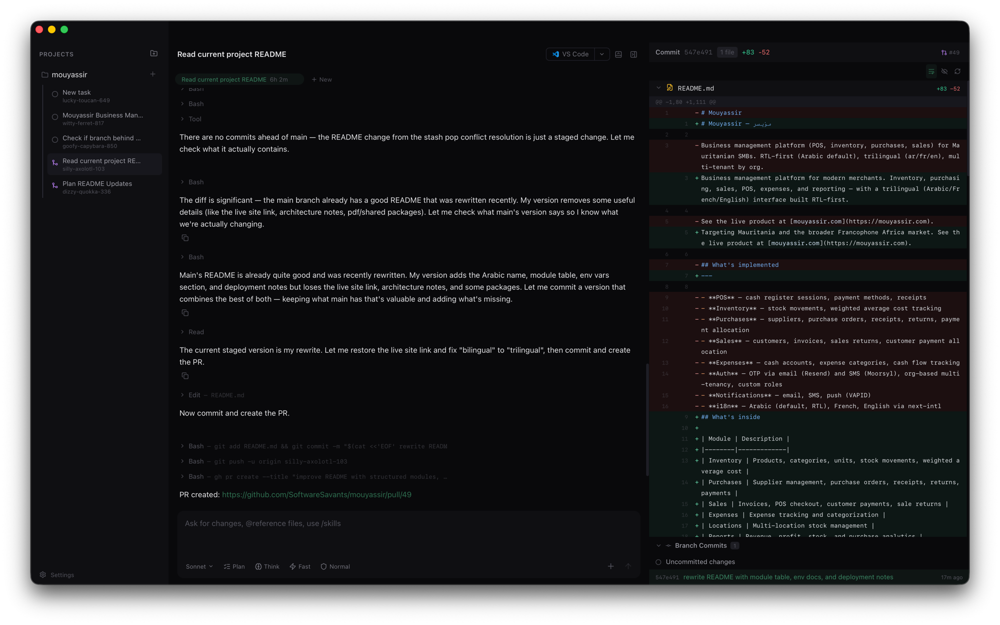

# Verun

Run multiple Claude Code sessions in parallel, each in its own isolated git worktree. Native macOS app.



## Features

- **Parallel sessions** — run as many Claude Code agents as you want, simultaneously
- **Isolated worktrees** — each task gets its own git worktree and branch, no conflicts
- **Lifecycle hooks** — auto-copy `.env` files, install deps, and start dev servers per task
- **Non-blocking setup** — setup hooks run in the background so you can start typing immediately
- **Port isolation** — 10 unique ports per task (`VERUN_PORT_0`–`9`), no collisions between parallel tasks
- **Auto-detect** — Claude analyzes your project and configures hooks, ports, and env files automatically
- **Code editor** — built-in CodeMirror 6 editor with One Dark syntax highlighting, code folding, and 15+ languages
- **TypeScript intellisense** — bundled LSP with autocomplete, diagnostics, hover, go-to-definition, find references, and rename
- **Unified tabs** — sessions and files share one tab bar; preview tabs replace on click, pin on double-click or edit
- **Quick Open** — CMD+P to fuzzy-find and jump to any file in the worktree
- **File tree** — gitignore-aware directory browser with lazy loading and filesystem watching
- **Inline diffs** — see exactly what Claude changed with syntax-highlighted diffs
- **Git actions** — commit, push, create PR, merge — all without leaving the app
- **Plan mode** — review implementation plans before Claude starts coding
- **Desktop notifications** — get notified when tasks complete, fail, or need approval
- **Tool approval** — configurable trust levels (Normal, Supervised, Full Auto)
- **Resumable** — sessions survive app restarts via `claude --resume`
- **Persistent history** — all output stored locally in SQLite
- **Integrated terminal** — drop into any task's worktree with a built-in shell
- **Shareable config** — `.verun.json` in your repo so teammates get the same setup
- **No account required** — works entirely local, no tokens or permissions needed

## Install

Download the latest `.dmg` from [Releases](https://github.com/SoftwareSavants/verun/releases), or build from source:

```bash
git clone https://github.com/SoftwareSavants/verun.git
cd verun
bash scripts/setup.sh
pnpm tauri build
```

Requires macOS, [Rust](https://rustup.rs), Node.js 18+, pnpm, and Xcode Command Line Tools.

## How It Works

```
Project (repo) → Tasks (worktrees) → Sessions (Claude conversations)
```

Add a repo, create tasks — each gets an isolated worktree with an auto-generated branch name like `sleepy-capybara-472`. Run multiple Claude Code sessions per task. Switch between them freely.

## Stack

Tauri v2 (Rust + tokio) / Solid.js + TypeScript / UnoCSS / xterm.js / SQLite

## Contributing

See [CONTRIBUTING.md](CONTRIBUTING.md).

## License

MIT
